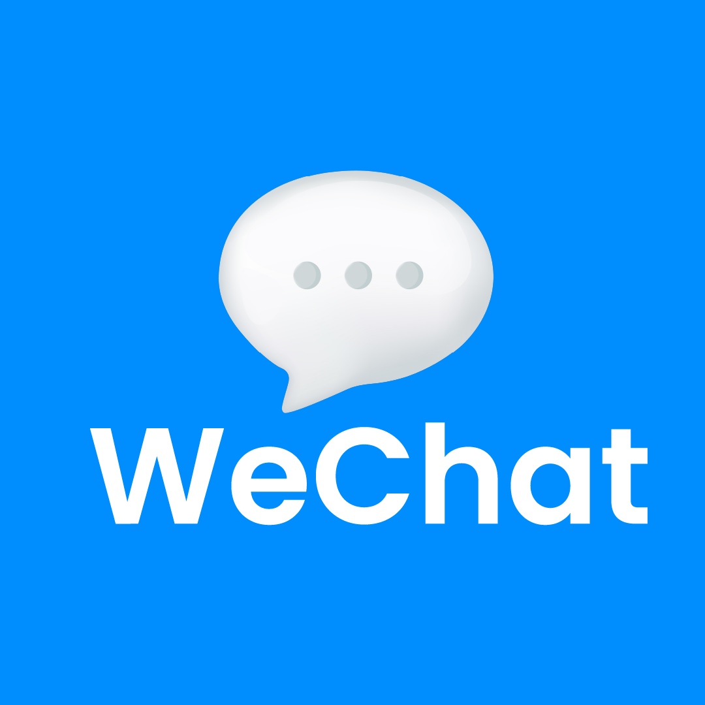

# WeChat Backend
[](https://skillicons.dev)
[](https://forthebadge.com)



WeChat is a mobile app that allows users to communicate in real-time. It offers messaging, calls, and video calls.  
**WeChat es una aplicación móvil que permite a los usuarios comunicarse en tiempo real. Ofrece mensajería, llamadas y videollamadas.**

This backend was written by **Jorge Enrique Hernandez Noyola** using the **Go** programming language.  
**Este backend fue escrito por **Jorge Enrique Hernandez Noyola** utilizando el lenguaje de programación **Go**.**

For the database, WeChat uses **MongoDB** to handle user data, group chats, and real-time messages.  
**Para la base de datos, WeChat utiliza **MongoDB** para gestionar los datos de usuario, chats grupales y mensajes en tiempo real.**

---

## Features / Características

- Real-time messaging between users.  
  **Mensajería en tiempo real entre usuarios.**

- Group chat functionality with restricted access for members.  
  **Funcionalidad de chat grupal con acceso restringido para los miembros.**

- Private individual messaging.  
  **Mensajes privados individuales.**

- Scalable backend using WebSockets and REST API.  
  **Backend escalable utilizando WebSockets y API REST.**

---

## Technologies Used / Tecnologías Utilizadas

- **Go**: The main programming language used for the backend.  
  **Go**: El lenguaje de programación principal utilizado para el backend.

- **MongoDB**: Database for storing user, message, and group information.  
  **MongoDB**: Base de datos para almacenar información de usuarios, mensajes y grupos.

- **Gorilla WebSocket**: Library for WebSocket communication.  
  **Gorilla WebSocket**: Biblioteca para la comunicación WebSocket.

---

## Installation / Instalación

1. Clone this repository:  
   **Clona este repositorio:**
   ```bash
   git clone https://github.com/yourusername/wechat-backend.git

2. Install Go dependencies::  
   **Instala las dependencias de Go:**
   ```bash
   go mod tidy

3. Create a .env_db file on the root of the project
    **crea un documento .env en la raiz del proyecto**
    ```bash
    touch .env_db

4. Create .env_db file and add your MongoDB variables:
    **crea un documento .env_db en la raiz del proyecto**
    ```env
    DB_URI=ADD_YOUR_MONGO_URI_CONNECTION
    DB_DATABASE=ADD_YOUR_DATABASE_NAME

5. Run the server:
    **Inicia el servidor**
    ```bash
    go run ./cmd/main.go

    or 

    Make start


---

## Configuration / Configuración
Modify server parameters using .env file
**Modifica parametros del servidor utilizando el archivo .env**

1. Create .env file on the root directory
   **Crea archivo .env en la raiz del directorio**
   ```bash
   touch .env

- PORT : The port the server is using/ El puerto el servidor esta usando **2565 default/por defecto**

2. Create .env_db file on the root directory
   **Crea archivo .env_db en la raiz del directorio**
   ```bash
   touch .env_db

- **DB_URI** : string that allows connection with database / cadena que permite conexión con la base de datos **REQUIRED/REQUERIDO**
- **DB_DATABASE** : Name of the database that you will be using / Nombre de la base de datos que estarás utilizando **REQUIRED/REQUERIDO**
- **DB_USERS** : Name of the collection the where the user documents will be saved / Nombre de la collección donde los documentos del usuario serán guardados **REQUIRED/REQUERIDO**
- **DB_GROUPD** : Name of the collection the where the grous documents will be saved / Nombre de la collección donde los documentos del los grupos serán guardados **REQUIRED/REQUERIDO**
- **DB_USR_CHLOGS** : Name of the collection the private chatlogs will be saved / Nombre de la colleccion donde los registros de los chats privados serán guardados **REQUIRED/REQUERIDO**
- **DB_GR_CHLOGS** : Name of the collection the group chatlogs will be saved / Nombre de la colleccion donde los registros de los mensajes de grupos serán guardados **REQUIRED/REQUERIDO**

---

## API Endpoints / Puntos de acceso a servidor
- **/l - POST** : Connection for login with account / conexion para iniciar sesión con cuenta **Check out required body filds and/or headers on enpoint handlers respectively / Revisa los campos body y/o encabezados requeridos en los puntos de accesso respectivos**
- **/cv?e={email}&c={code} - PUT** : Connection that verifies the code sent to user to their email inbox / conexion que permite verificar el codigo de acceso enviado a su bandeja de entrade de su correo electonico **Check out required body filds and/or headers on enpoint handlers respectively / Revisa los campos body y/o encabezados requeridos en los puntos de accesso respectivos**
- **/nsg - POST** : Connection that allow user to create a new account / Conexion que permite nuevo usuario crear una cuenta nueva **Check out required body filds and/or headers on enpoint handlers respectively / Revisa los campos body y/o encabezados requeridos en los puntos de accesso respectivos**
- **/chats - GET** : Connection that gets all the current chats and/or groups the user has initiated / Conexion que trae todos los chats y/o grupos el usuario ha iniciado **Check out required body filds and/or headers on enpoint handlers respectively / Revisa los campos body y/o encabezados requeridos en los puntos de accesso respectivos**
- **/nch?chtid={chat_id} - GET** : Connection that allows user to send messages weather is a private conversation or a group
- **/lkup?qry={search_query} - GET** Connection that allows user to search for other users or groups / Conexión que permite buscar a otros usuarios o grupos 
- **/sndmsg?chtid={chat_id}&crruid={current_user_id} - PUT** Connection that allows user to send a message / Conexión que permite al usuarion mandar un mensaje **Check out required body filds and/or headers on enpoint handlers respectively / Revisa los campos body y/o encabezados requeridos en los puntos de accesso respectivos**
- **/cllusr?chtid={chat_id} - POST** : Connection that allows user to call another user / Conexion que permite llamar a otros usuarios **Check out required body filds and/or headers on enpoint handlers respectively / Revisa los campos body y/o encabezados requeridos en los puntos de accesso respectivos** - **Only for users not groups/Solo para usuarios no en grupos**
- **/vcllusr?chtid={chat_id} - POST** : Connection that allows user to video call another user / Conexión que permite al usuario hacer videollamada con otro usuario **Check out required body filds and/or headers on enpoint handlers respectively / Revisa los campos body y/o encabezados requeridos en los puntos de accesso respectivos** - **Only for users not groups/Solo para usuarios no en grupos**
---

## Architecture Overview / Descripción de la Arquitectura

- The backend manages WebSocket, WebRTC connections and handles message routing, video calls and voice calls.
  **El backend gestiona las conexiones WebSocket, WebRTC y maneja el enrutamiento de mensajes, video llamadas y llamadas por voz.**

---
## Contributing / Contribuciones

Feel free to submit pull requests and issues.
**Siéntete libre de enviar solicitudes de extracción y reportar problemas.**
---

**Created by Jorge Enrique Hernandez Noyola.
Creado por Jorge Enrique Hernandez Noyola.**
